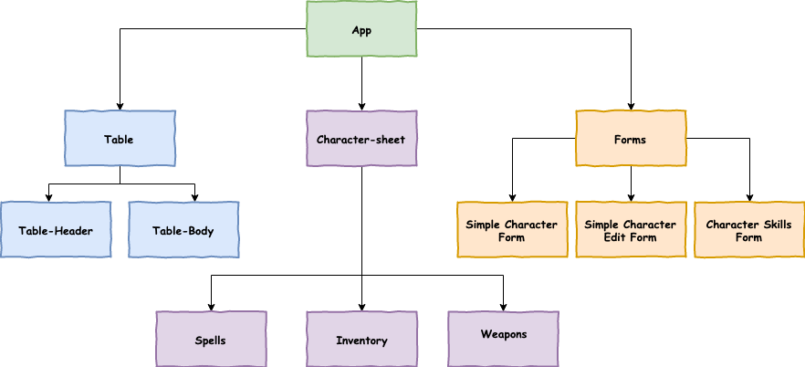
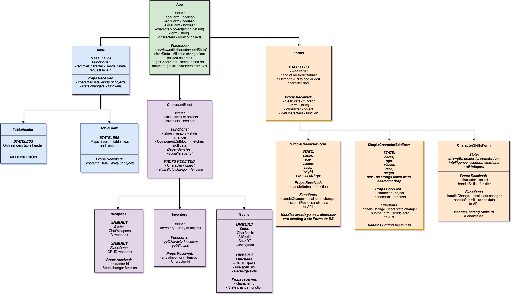

# Charactor Creator

## Requirements

- Create character using standard 5th edition rules
- Be able to level up a character according to these rules.
- Be able to save a character and load it.
- Be able to delete a character.
- DM's should have access to all characters in their game.
- Players should be able to roll dice to generate stats.
- Players will need all classes, races and relevant sub-races/sub-classes available.
- Rules should be displayed in an easy to read manner while also demonstrating the source text.
- DM's need to be able to start a game and let other players join it, posting their character to it.
- DM's need to be able to 'sign off' on each character.
- DM's & Players should be able to arrange a date on the app.
- DM's & Players need access to magical items & spells.
- DM's & Players need access to to all rules.


## Dependancies

- React front end
- Ruby  on Rails Back end
- CSS - styling


## Get Started

```
- Clone or download this repo
- Run npm install to ensure all Dependancies are installed.
- run npm start and visit localhost:3000
```
## Using the App Currently

- Currently a user can add a character and its basic info and skills.
- The Database is not a deployed nor continually live please visit its repo [here, sorry no readme, just download and run rails s](https://github.com/stonefarmer9/characters-api)
- Once thats running you can save characters and enjoy the current working progress of the app.

## Description

An app designed to be used to manage games of dungeons & dragons or other role-playing games. Currently able to create a character and load there sheet with information.

## Approach

This project was approached as the first personal project I carried out having finished makers. A large project I have started with the starting point for a player, building a character.

The project was not test driven, sacrificing test-driven control for learning React and its many applications. This approach was also taken as I was unsure of what to expect when working with the new library and wanted to worry about learning what React can do before learning how to test that it does what I expect.


## App Models
### A simple component model


### A More detailed tree



## Component Break Down

 - App - Main page User visits on entry, shows them a table of their current characters. Retrieves data from rails API.

 - Simple character form - takes basic name, age, height, race, class and sex information needed for a character. Sends request to railsAPI to store the info.
 - Simple character edit form - Same as above but for editing that information.

 - Table header/body - responsible for fetching character data and rendering it as a table with buttons to change APPs state.

 - Inventory - Listing component for showing inventory (Work in progress)

 - Character skills form - takes the characters skills value and returns it plus the modifier applied to the character using the modifiers scrips in scripts directory. Also sends request to RAILS API to save skills.

 - Forms - a controller for add/edit skill and character forms.

 - Character sheet - pulls all info from above together and can display the data as needed through user interface.

## Work to be done


Due to the nature of this project this will be kept updated with what is the next step for me to complete.

 - ~~Inventory - Add items to the inventory array in state.~~

 - ~~Add Inventory to Rails API associated to character~~

 - Get adding inventory items working NEXT.

 - Remove hardcoded values.

 - ~~Connect to DnD API (yay its finally here!!!) and retrieve items data, structure and display it so add list can be a tick section not text box input.~~

 - Style the ever-loving-shit out of it.

 - Look at Styles Grids.

 - I need to reconsider my structure of inventory and how many children the component has and how many need state - Could work better if inventory did all the API fetching.

 - The number of API requests is getting high and will get higher, this could be resolved by creating my own database to draw from rather than a public API ?


## Contributing
  Feel free to help a brother out, clone this repo and submit a pull request and I shall endeavour to google how to deal with that situation.

## Author

Georges Le Vaillant

## Learnings

This section began on 27/05/2019 and will account for important learnings since then.

  - Using JSX fragments correctly
  - Making a scrollable component
  - Managing whitespace provided by .map for JSX returns
  - CSS grid usage and deployment
  - Can view the designed grid through dev tools
  - If an API does not have CORS installed a javascript program will not be able to directly fetch data, you can use a proxy like the one in equipmentList Fetch to bypass this problem.

  - I have not setup and declared my grids correctly. I need to go through each component grid from bottom to top, the top level grid I believe is working.
    - Possibly: Poor naming of different grids and CSS variables are pinning to wrong grid.
    - Possibly: My column, row sizes are not large enough for the large scale change I expect.
    - Solutions:
          - First: research grid and check your grids are correct.
          - Second: Re-configure/design your grids & nested grids from bottom to top.
